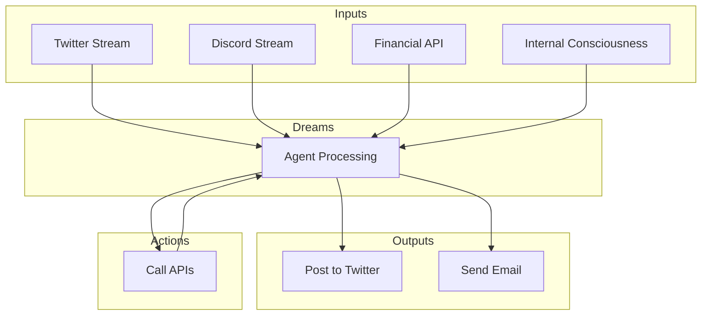

> ⚠️ **Warning**: This is alpha software under active development. Expect
> frequent breaking changes and bugs. The API is not yet stable.

# Architecture

Daydreams is a powerful yet simple system where agents process input streams
into actions. The actions' results feed back as new inputs, creating a
continuous loop of processing and execution - all orchestrated automatically by
the LLM's reasoning capabilities.



## Features

### 🔌 Any LLM Provider

Seamlessly integrate with any LLM provider through the AI SDK. Switch between
providers or use multiple providers simultaneously for different tasks.

- OpenAI
- Anthropic
- Gemini
- Groq
- Ollama
- And more!

```ts
const dreams = createDreams({
  model: groq("deepseek-r1-distill-llama-70b"),
});
```

### 🎮 Simple IO Interface

A straightforward and intuitive input/output interface that makes it easy to
build and control your agents without complex setup.

### 💉 Dynamic Context Injection

Inject context and information dynamically into your agent's reasoning process,
allowing for real-time adaptation and response to changing conditions.

### 💾 Memory Adaptors

Bring your own memory solution or use our built-in adaptors. Flexible memory
management that lets you choose how your agents store and retrieve information.

### 🧩 Extensions

Easily extend your agent's capabilities with drop-in clients for various
platforms:

- Twitter integration
- Telegram support
- Model Context Protocol (MCP) support coming soon
- And more!

### 🔗 Chain Agnostic

Execute transactions and interact with any blockchain network seamlessly.

- Ethereum
- Solana
- Arbitrum
- Optimism
- Base
- Polygon
- And more!

### 🎯 Goal-Oriented Behavior

Long-term planning and goal-oriented behavior capabilities for complex task
execution.

### 🤔 Advanced Reasoning

Multi-step reasoning using Hierarchical Task Networks for sophisticated
decision-making.

Want to contribute? Check our
[issues](https://github.com/daydreamsai/daydreams/issues) for tasks labeled
`good first issue`.
