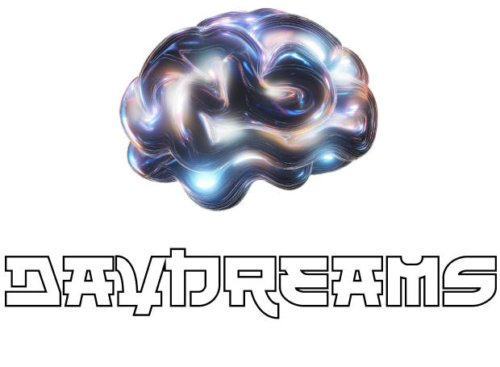

<p align="center">
  
</p>

# Daydreams - Generative Agent Framework

Daydreams is a powerful framework for building generative agents that can
execute tasks across any blockchain or API. It provides a flexible architecture
for creating autonomous agents with:

- Chain-agnostic blockchain interactions
- Deep research capabilities
- Multi-expert collaboration
- Memory and context management
- Goal-oriented behavior

## Quick Start

Prerequisites:

- Node.js 18+ using [nvm](https://github.com/nvm-sh/nvm)
- [bun](https://bun.sh/)

```bash
# Install dependencies
bun install

# Copy environment variables
cp .env.example .env

# Run an example
bun run example:discord
```

## Core Concepts

### Agents

Agents are the main building blocks in Daydreams. An agent has:

- **Inputs** - Ways to receive information (Discord, Telegram, API webhooks etc)
- **Outputs** - Ways to take action (sending messages, making transactions etc)
- **Actions** - Discrete operations the agent can perform
- **Memory** - Storage for conversation history and state
- **Experts** - Specialized modules for specific tasks

```typescript
const agent = createDreams({
  // Language model to use
  model: groq("llama-70b"),

  // Memory storage
  memory: createMemoryStore(),

  // Input handlers
  inputs: {
    "discord:message": input({
      schema: messageSchema,
      handler: handleMessage,
    }),
  },

  // Output handlers
  outputs: {
    "discord:reply": output({
      schema: replySchema,
      handler: sendReply,
    }),
  },

  // Available actions
  actions: [searchWeb, fetchGitHubRepo],

  // Expert systems
  experts: {
    researcher: researchExpert,
    planner: planningExpert,
  },
});
```

### Chain Support

Daydreams provides a unified interface for interacting with different
blockchains:

```typescript
// EVM chains (Ethereum, Polygon etc)
const eth = new EvmChain({
  chainName: "ethereum",
  rpcUrl: "...",
  privateKey: "...",
});

// Solana
const sol = new SolanaChain({
  chainName: "solana-mainnet",
  rpcUrl: "...",
  privateKey: "...",
});

// Starknet
const stark = new StarknetChain({
  rpcUrl: "...",
  address: "...",
  privateKey: "...",
});
```

### Memory System

The memory system stores conversation history and execution state:

```typescript
// In-memory store
const memory = createMemoryStore();

// MongoDB store
const mongoMemory = await createMongoMemoryStore({
  uri: "mongodb://...",
  dbName: "dreams",
});
```

### Expert Systems

Experts are specialized modules that handle specific types of tasks:

```typescript
const researcher = expert({
  description: "Conducts deep research on topics",
  actions: [generateQueries, processResults, writeReport],
});
```

## Architecture

The v1 architecture consists of:

### Core Components

- **Dreams** - Main agent orchestrator
- **Chain of Thought** - Reasoning engine
- **Memory** - State management
- **Experts** - Specialized capabilities
- **Actions** - Discrete operations
- **I/O Handlers** - Input/output management

### Chain Support

- **EVM** - Ethereum, Polygon, BSC etc
- **Solana** - Solana blockchain
- **Starknet** - StarkNet L2

### Integrations

- Discord
- Telegram
- GitHub
- Web Search
- Custom APIs

## Examples

The project includes several example implementations:

```bash
# Discord bot
bun run example:discord

# Telegram bot
bun run example:telegram

# GitHub code assistant
bun run example:github
```

## Development

```bash
# Build the project
bun build:core

# Generate docs
bun docs
```

## Contributing

Contributions are welcome! Please see our [Contributing Guide](CONTRIBUTING.md).

## License

MIT License - see [LICENSE](LICENSE) for details.

## Star History

[](https://star-history.com/#daydreamsai/daydreams&Date)
